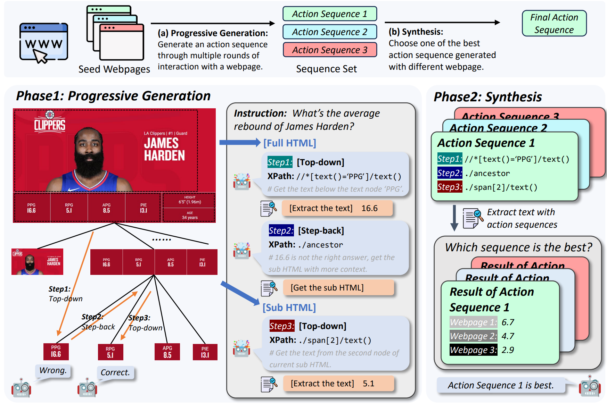

# AutoScraper

<div align="center">
    <a href="https://arxiv.org/pdf/2404.12753.pdf"></a>
    <a href="https://hits.seeyoufarm.com"></a>
    <!-- <a href="https://twitter.com/xuhaiya2483846/status/1654640739010351106"></a> -->
</div>


This is the official code for paper *"AutoScraper: A Progressive Understanding Web Agent for Web Scraper Generation"*.



## Setup 
```bash
# Clone the AutoScraper repository
git clone https://github.com/EZ-hwh/AutoCrawler

# Change directory into the cloned repository
cd AutoCrawler

# Optional: Create a Conda environment for AutoScraper
# conda create -n autocrawler python=3.9
# conda activate autocrawler

# Install required dependencies
pip install -r requirements.txt
```

## TODOs

- [x] Public the experimental code.
- [ ] Adapt AutoScraper for real-world websites.
- [ ] Website for showing our demo and testing.

## Experiments
If you want to reproduce the result we report in paper.

```bash
# Generate scraper with AutoScraper
python crawler_generation.py \
    --pattern reflexion \
    --dataset swde \
    --model ChatGPT \
    --seed_website 3 \
    --save_name ChatGPT \
    --overwrite False

# Extract information with scraper
python crawler_extraction.py \
    --pattern autocrawler \
    --dataset swde \
    --model GPT4

# Evaluate the extraction on SWDE dataset
python run_swde/evaluate.py \
    --model GPT4 \
    --pattern autocrawler
```

## 📝 Citation
If you find this work useful, please consider citing our work:
```
@misc{huang2024autoscraperprogressiveunderstandingweb,
      title={AutoScraper: A Progressive Understanding Web Agent for Web Scraper Generation}, 
      author={Wenhao Huang and Zhouhong Gu and Chenghao Peng and Zhixu Li and Jiaqing Liang and Yanghua Xiao and Liqian Wen and Zulong Chen},
      year={2024},
      eprint={2404.12753},
      archivePrefix={arXiv},
      primaryClass={cs.CL},
      url={https://arxiv.org/abs/2404.12753}, 
}
```
