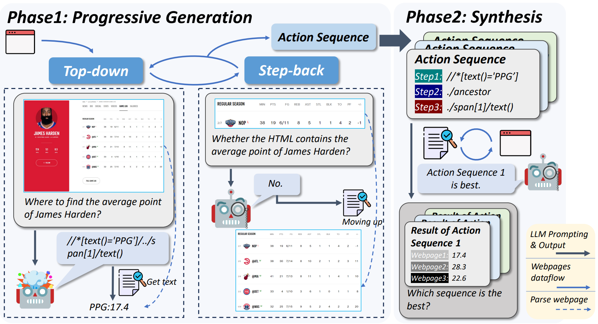

# AutoCrawler

This is the official code for paper *"AutoCrawler: A Progressive Understanding Web Agent for Web
Crawler Generation"*. In this work, we ask large language model (LLMs)


## Setup 
```bash
# Clone the AutoCrawler repository
git clone https://github.com/EZ-hwh/AutoCrawler

# Change directory into the cloned repository
cd AutoCrawler

# Optional: Create a Conda environment for OSWorld
# conda create -n autocrawler python=3.9
# conda activate autocrawler

# Install required dependencies
pip install -r requirements.txt
```

## TODOs

- [x] Public the experimental code.
- [ ] Adapt AutoCrawler for real-world websites.
- [ ] Website for showing our demo and testing.

## Experiments
If you want to reproduce the result we report in paper.

```bash
# Generate crawler with AutoCrawler
python crawler_generation.py \
    --pattern reflexion \
    --dataset swde \
    --model ChatGPT \
    --seed_website 3 \
    --save_name ChatGPT \
    --overwrite False

# Extract information with crawler
python crawler_extraction.py \
    --pattern autocrawler \
    --dataset swde \
    --model GPT4

# Evaluate the extraction on SWDE dataset
python run_swde/evaluate.py \
    --model GPT4 \
    --pattern autocrawler
```

## 📝 Citation
If you find this work useful, please consider citing our work:
```
@misc{huang2024autocrawler,
      title={AutoCrawler: A Progressive Understanding Web Agent for Web Crawler Generation}, 
      author={Wenhao Huang and Chenghao Peng and Zhixu Li and Jiaqing Liang and Yanghua Xiao and Liqian Wen and Zulong Chen},
      year={2024},
      eprint={2404.12753},
      archivePrefix={arXiv},
      primaryClass={cs.CL}
}
```